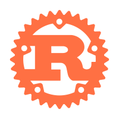

<!--
 * @Date: 2024-03-15 13:38:47
 * @Author: Bruce Hsu
 * @Description: 
-->
# 
My Name is Bruce

## 
Hi 👋, I'm a full-stack developer from China

    
    
    

### Languages and Tools

    
    
    
    
    
    
    
    
    
    
    
    
    
    
    
    
    
    
    
    
    
    
    
    

